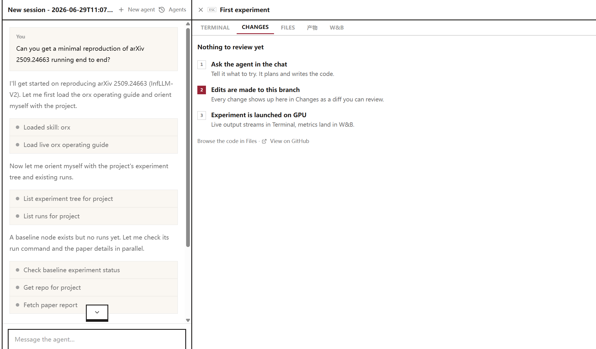

### 1.Topic: Superpower Skill


Claude Code is powerful out of the box, but without structure, it jumps straight into coding: no planning, no tests, no systematic approach. The Superpowers plugin fixes this issue by enforcing proven development workflows that prevent the chaos.

#### What Superpowers actually does

Superpowers is a skills framework that intercepts Claude Code at key moments. Instead of immediately writing code when you ask for something, it stops and asks questions first. Then it enforces TDD, creates implementation plans, and reviews its own work before moving on.

The core workflow:

1. **Brainstorm**: refines your idea through Socratic questioning
2. **Plan**: creates bite-sized tasks (2-5 minutes each) with exact file paths
3. **Execute**: dispatches subagents per task with two-stage review
4. **Finish**: verifies tests, offers PR/merge options, cleans up

#### Installation (10 Seconds)


```bash
# Open the plugin menu
/plugin

# Navigate to "Discover" tab
# Search for "superpowers"
# Select and install
```

After installation, restart Claude Code. You'll see "SessionStart:startup hook succeeded: Success" confirming the plugin is active.


#### What gets installed

The plugin bundles everything you need:

| Component    | Included                                                     |
| :----------- | :----------------------------------------------------------- |
| **Commands** | execute-plan, write-plan, brainstorm                         |
| **Agents**   | code-reviewer                                                |
| **Skills**   | 14 skills including TDD, debugging, git worktrees, code review |
| **Hooks**    | SessionStart (auto-bootstraps the workflow)                  |

#### The three core commands

##### /superpowers:brainstorm

Use this before ANY new feature. Claude will:

- ask clarifying questions about your goal
- explore alternatives you haven't considered
- present the design in digestible chunks for validation
- save a design document for reference

**When to trigger:** Start of any feature, refactor, or migration.

##### /superpowers:write-plan

After brainstorming, this creates an implementation plan where:

- each task takes 2-5 minutes maximum
- every task has exact file paths and complete code snippets
- verification steps are built into each task
- the plan assumes an "enthusiastic junior engineer with no context" will execute it

##### /superpowers:execute-plan

Runs the plan using subagent-driven development:

- fresh subagent spawned per task (clean context)
- two-stage review: spec compliance, then code quality
- human checkpoints between batches
- critical issues block progress automatically

#### The 14 skills explained

| Skill                              | What it does                                                 |
| :--------------------------------- | :----------------------------------------------------------- |
| **test-driven-development**        | Enforces RED-GREEN-REFACTOR. Deletes code written before tests. |
| **systematic-debugging**           | 4-phase root cause process with defense-in-depth             |
| **using-git-worktrees**            | Creates isolated branch, runs setup, verifies clean baseline |
| **using-superpowers**              | Introduction to the skills system                            |
| **dispatching-parallel-agents**    | Concurrent subagent workflows                                |
| **executing-plans**                | Batch execution with checkpoints                             |
| **finishing-a-development-branch** | Merge/PR/keep/discard options, cleanup                       |
| **brainstorming**                  | Socratic design refinement                                   |
| **writing-plans**                  | Detailed implementation planning                             |
| **requesting-code-review**         | Pre-review checklist, blocks on critical issues              |
| **receiving-code-review**          | Responding to feedback systematically                        |
| **writing-skills**                 | Meta-skill for creating new skills                           |
| **verification-before-completion** | Ensures fixes actually work                                  |
| **subagent-driven-development**    | Two-stage review per task                                    |


#### How skills trigger automatically

Skills aren't commands you call - they activate based on context:

- start discussing a new feature → **brainstorming** activates
- design approved → **using-git-worktrees** activates
- implementation begins → **test-driven-development** activates
- task completed → **requesting-code-review** activates
- all tasks done → **finishing-a-development-branch** activates

Claude checks for relevant skills before any task. These are mandatory workflows, not suggestions.

#### Git worktree integration

Superpowers uses git worktrees for isolated development:


```bash
# What happens behind the scenes:
git worktree add ../project-feature feature-branch
cd ../project-feature
# Claude works here, main branch stays clean
```

Benefits:

- run multiple Claude instances on different features
- keep main branch stable during experimentation
- easy cleanup if things go wrong

#### Subagent-driven development

The most powerful pattern. Instead of one long Claude session:

1. Main agent creates the plan
2. Fresh subagent executes each task
3. Review agent (code-reviewer) checks the work
4. Main agent continues or requests fixes

Why this works: each subagent starts with clean context focused on ONE task. No accumulated confusion from long sessions.

#### TDD enforcement

Superpowers takes TDD seriously. The skill:

- requires failing test BEFORE implementation
- watches the test fail (proves it tests something)
- implements minimal code to pass
- commits at green
- refactors only after green

If Claude writes code before tests, the skill instructs it to delete that code and start over.

#### Practical example

```
You: I need user authentication for my Express app Claude (with Superpowers): → Activates brainstorming skill → Asks: OAuth or passwords? Session or JWT? What providers? → Explores: Rate limiting? Account lockout? Password requirements? → Presents design in sections for your approval You: Looks good, let's plan it Claude: → Activates writing-plans skill → Creates 12 tasks, each 2-5 minutes → Task 1: Create failing test for /signup endpoint → Task 2: Implement signup handler to pass test → Each task has exact file paths and code You: Execute Claude: → Spawns subagent for Task 1 → code-reviewer agent validates output → Spawns subagent for Task 2 → Reports progress, asks for approval to continue
```

#### Managing the plugin

From the /plugin menu you can:

- **Disable plugin**: temporarily turn off
- **Mark for update**: flag for next update cycle
- **Update now**: get latest version immediately
- **Uninstall**: remove completely
- **View on GitHub**: see source code

#### When NOT to use Superpowers

- quick one-off questions
- simple file edits
- tasks under 5 minutes

For these, the overhead isn't worth it. Superpowers shines on multi-file features, refactors, and migrations requiring systematic execution.

#### Quick Reference

| Action       | How                                         |
| :----------- | :------------------------------------------ |
| Install      | `/plugin` → Discover → superpowers          |
| Start design | `/superpowers:brainstorm`                   |
| Create plan  | `/superpowers:write-plan`                   |
| Execute plan | `/superpowers:execute-plan`                 |
| Update       | `/plugin` → select superpowers → Update now |

Superpowers transforms Claude Code from "helpful assistant that sometimes goes off the rails" into "systematic development partner that follows proven processes." The structured workflow prevents the most common failure modes: skipped tests, missing edge cases, and features that drift from requirements.


## 2.openresearch.sh 复现论文

关联了自己的github之后的界面





## 3.claude 常用终端命令速查

```bash
claude                         # 进入交互式 Claude Code
claude "解释这个项目"           # 带初始提示进入会话
claude -p "解释这个函数"         # 非交互查询，输出后退出
cat logs.txt | claude -p "解释" # 管道输入
claude -c                      # 继续当前目录最近会话
claude -r "session-name"        # 按 ID 或名称恢复会话
claude update                  # 更新
claude install stable          # 安装/重装指定版本或稳定版
claude auth login              # 登录
claude auth status             # 查看登录状态
claude agents                  # 打开后台会话/agent view
claude attach <id>             # 进入某个后台会话
claude logs <id>               # 查看后台会话日志
claude stop <id>               # 停止后台会话
claude project purge --dry-run # 预览清理项目本地 Claude Code 状态
claude mcp                     # 管理 MCP
claude plugin                  # 管理插件
claude ultrareview 1234 --json # 非交互深度审查 PR
```

这些命令来自官方 CLI reference 的命令表。([Claude API Docs](https://docs.anthropic.com/en/docs/claude-code/cli-reference))

## 会话内 `/命令` 分类版大全

**项目初始化 / 上下文 / 记忆**

```text
/init
/memory
/add-dir <path>
/context [all]
/compact [instructions]
/clear [name]
/resume [session]
/branch [name]
/rewind
```

`/init` 生成 `CLAUDE.md`，`/memory` 编辑记忆文件，`/context` 看上下文占用，`/compact` 压缩长会话，`/clear` 开新上下文，`/resume` 恢复会话，`/rewind` 回滚代码或对话检查点。([Claude Code](https://code.claude.com/docs/en/commands))

**模型 / 推理 / 模式**

```text
/model [model]
/effort [low|medium|high|xhigh|max|auto]
/fast [on|off]
/plan [description]
/permissions
/config
/status
```

`/model` 切模型，`/effort` 调 reasoning 强度，`/fast` 切快速模式，`/plan` 进入计划模式，`/permissions` 管理工具权限，`/config` 打开设置。([Claude Code](https://code.claude.com/docs/en/commands))

**代码审查 / 变更检查 / 发布前**

```text
/diff
/code-review [low|medium|high|xhigh|max|ultra] [--fix] [--comment] [target]
/simplify [target]
/review [PR]
/security-review
/ultrareview [PR]
/verify
/run
```

`/diff` 看改动，`/code-review` 查 bug 和清理建议，`/simplify` 做清理型修复，`/security-review` 查安全问题，`/verify` 和 `/run` 更偏“运行应用并验证变更”。`/run`、`/verify` 要求 Claude Code v2.1.145 或更高。([Claude Code](https://code.claude.com/docs/en/commands))

**后台任务 / 并行 agent / 大任务**

```text
/agents
/background [prompt]   # /bg
/tasks                 # /bashes
/goal [condition|clear]
/batch <instruction>
/workflows
/loop [interval] [prompt]
```

`/background` 把当前会话分离到后台，`/tasks` 看后台任务，`/goal` 让 Claude 持续推进直到条件满足，`/batch` 拆大任务到多个 worktree，`/workflows` 管理动态工作流。([Claude Code](https://code.claude.com/docs/en/commands))

**插件 / Skills / MCP / Hooks**

```text
/skills
/reload-skills
/plugin
/reload-plugins
/mcp
/hooks
/claude-api [migrate|managed-agents-onboard]
```

Skills 是新版自定义命令体系；官方内置 bundled skills 包括 `/code-review`、`/batch`、`/debug`、`/loop`、`/claude-api`，并且可以用 `/skill-name` 直接调用。([Claude Code](https://code.claude.com/docs/en/skills))

**远程 / Web / PR 自动修复**

```text
/remote-control        # /rc
/remote-env
/teleport              # /tp
/desktop               # /app
/web-setup
/autofix-pr [prompt]
/install-github-app
```

这些用于 Claude Code on the web、远程控制、把 web 会话拉回终端、自动修复 PR、GitHub App 配置等。([Claude Code](https://code.claude.com/docs/en/commands))

**UI / 终端 / 体验**

```text
/theme
/color [color|default]
/copy [N]
/export [filename]
/focus
/tui [default|fullscreen]
/terminal-setup
/keybindings
/voice [hold|tap|off]
/recap
```

`/theme` 切主题，`/copy` 复制回复，`/export` 导出会话，`/tui` 切终端渲染模式，`/recap` 生成会话摘要，`/voice` 控制语音输入。([Claude Code](https://code.claude.com/docs/en/commands))

**账号 / 诊断 / 反馈**

```text
/login
/logout
/doctor
/debug [description]
/feedback [report]
/release-notes
/usage
/usage-credits
/upgrade
/privacy-settings
```

`/doctor` 诊断安装和设置，`/debug` 排查日志，`/feedback` 反馈问题，`/usage` 看使用量和限制，`/usage-credits` 配置额外用量。([Claude Code](https://code.claude.com/docs/en/commands))

## 我会优先看这三份

- **想查命令怎么用**：看官方 **Commands**。
- **想查 `claude --xxx` 参数**：看官方 **CLI reference**。
- **想跟上最近三个月变化**：看中文 **最新动态**，尤其第 17–22 周。([Claude Code](https://code.claude.com/docs/en/commands))


`/mcp` 是 **Claude Code 会话内用来查看、连接、认证和管理 MCP 服务器状态的命令**。

MCP 可以理解成“给 Claude Code 接外部工具/数据源的接口”。接上后，Claude 不只看你粘贴的内容，还可以通过 MCP 访问 GitHub、Jira、Sentry、Postgres、Notion、Slack、Gmail、自定义 API 等工具或数据源。官方说明 MCP servers 会给 Claude Code 访问工具、数据库和 API 的能力。([Claude Code](https://code.claude.com/docs/en/mcp))

## `/mcp` 主要有 5 个用途

| 用途                          | 说明                                                         |
| ----------------------------- | ------------------------------------------------------------ |
| **查看已配置的 MCP 服务器**   | 看当前项目/用户配置里有哪些 MCP server，哪些已连接、失败、等待认证。 |
| **检查连接状态**              | 官方文档里把 `/mcp` 标为“within Claude Code: Check server status”。([Claude Code](https://code.claude.com/docs/en/mcp)) |
| **OAuth 登录/授权**           | 很多远程 MCP 需要浏览器登录。流程通常是先 `claude mcp add ...` 添加服务，然后进入 Claude Code 输入 `/mcp`，按提示打开浏览器授权。([Claude Code](https://code.claude.com/docs/en/mcp)) |
| **清除认证**                  | `/mcp` 菜单里有 “Clear authentication”，可撤销某个 MCP 的登录授权。([Claude Code](https://code.claude.com/docs/en/mcp)) |
| **发现 MCP 提供的工具和命令** | MCP 服务器可以暴露工具，也可以暴露 prompt，这些 prompt 会变成 `/mcp__<server>__<prompt>` 形式的动态命令。([Claude Code](https://code.claude.com/docs/en/commands)) |

## 典型用法

先在终端添加一个 MCP server：

```bash
claude mcp add --transport http sentry https://mcp.sentry.dev/mcp
```

然后进入 Claude Code：

```bash
claude
```

在会话里输入：

```text
/mcp
```

它会显示 MCP 连接状态；如果需要登录，会引导你走浏览器 OAuth 授权。官方 Sentry 示例也是先添加 server，再运行 `/mcp` 认证，然后就能问 Claude “最近 24 小时最常见的错误是什么？”这类问题。([Claude Code](https://code.claude.com/docs/en/mcp))

## 和 `claude mcp ...` 的区别

`/mcp` 是 **Claude Code 里面的斜杠命令**，偏“查看状态、登录、授权、清认证”。

`claude mcp ...` 是 **终端命令**，偏“添加、删除、查看配置”：

```bash
claude mcp list              # 列出配置的 MCP server
claude mcp get github        # 查看某个 server 详情
claude mcp remove github     # 删除某个 server
claude mcp add ...           # 添加 server
claude mcp add-json ...      # 用 JSON 配置添加 server
```

官方文档也把这些管理命令和 `/mcp` 区分开：`claude mcp list/get/remove` 管配置，`/mcp` 在 Claude Code 内检查 server 状态。([Claude Code](https://code.claude.com/docs/en/mcp))

一句话：**`/mcp` 就是 Claude Code 里的 MCP 控制面板入口，用来确认外部工具是否接好了、是否要登录、能暴露哪些能力。**


