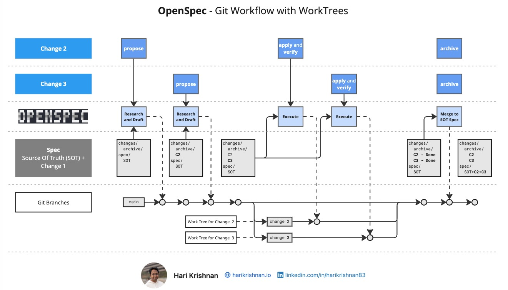
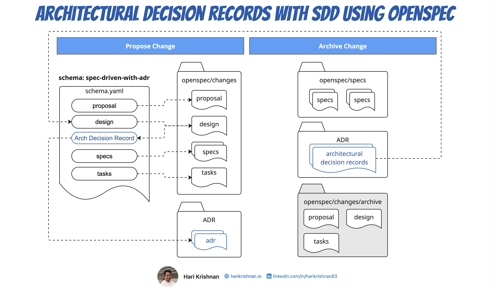

### Topic: OpenSpec

https://intent-driven.dev/knowledge/openspec/

On This Page[Overview](https://intent-driven.dev/knowledge/openspec/#overview)[How OpenSpec Works](https://intent-driven.dev/knowledge/openspec/#workflow)[Video Tutorials](https://intent-driven.dev/knowledge/openspec/#videos)[Workflow Diagrams](https://intent-driven.dev/knowledge/openspec/#diagrams)[Blog Posts](https://intent-driven.dev/knowledge/openspec/#blog-posts)[Key Benefits](https://intent-driven.dev/knowledge/openspec/#benefits)[When to Use OpenSpec](https://intent-driven.dev/knowledge/openspec/#when-to-use)[Resources](https://intent-driven.dev/knowledge/openspec/#resources)[Related Topics](https://intent-driven.dev/knowledge/openspec/#related)

## Overview

OpenSpec is a Spec-Driven Development (SDD) tool that emphasizes maintaining a **single, unified specification document** as the authoritative reference for a system's design and capabilities. Unlike traditional approaches that distribute specifications across multiple files, OpenSpec consolidates the current state of a system into one "living" specification that continuously evolves with the codebase.

This source of truth approach addresses persistent challenges in fragmented specification systems, where the overall system intent becomes hard to grasp holistically, feature interactions go undetected until implementation, and validating the complete specification against the live system becomes nearly impossible.

## How OpenSpec Works

The OpenSpec workflow revolves around three key artifact types:

### Change Specifications (Delta Specs)

Delta specs represent proposed modifications. These interim documents mark sections as "ADDED," "MODIFIED," or "REMOVED," clearly communicating what has changed. This makes it easy for both humans and AI agents to understand exactly what's being proposed without needing to diff entire documents.

### Source of Truth Specification

The primary specification represents the system's actual state. All delta changes eventually merge into this single document during the archive phase, creating a definitive reference that stakeholders can consult. This ensures everyone is working from the same understanding of what the system does.

### Archived Specifications

Archived specs preserve the historical lineage of earlier delta specs once they've been incorporated into the source of truth, maintaining an audit trail of evolution. This creates accountability and allows teams to understand how and why decisions were made.

### Parallel Development with Git WorkTrees

Git WorkTrees let you check out multiple branches simultaneously in separate directories. Combined with SubAgents in OpenCode, this enables genuine parallel feature development: propose on the main branch, apply each change in an isolated worktree via a SubAgent, then merge and archive in order. Each SubAgent runs Verify before merge, keeping the source of truth spec consistent across all parallel streams.

### Architectural Decision Records

Custom OpenSpec schemas can extend the workflow with additional durable artifacts. The `spec-driven-with-adr` schema introduces Architectural Decision Records (ADRs) that live alongside the source of truth spec, outside of any single change. Specs capture the current state of the system's functionality; ADRs capture the current state of its architecture — the context, options, choices, and consequences behind every significant technical decision. Both artifacts persist after a change is archived, so future proposals can leverage prior reasoning during design instead of rediscovering it.

## Video Tutorials

Learn OpenSpec workflows and best practices through our video tutorials. The playlist covers everything from getting started to advanced integration patterns.

## Workflow Diagrams

Visual guides to understanding OpenSpec workflows and integration patterns.

### OpenSpec Workflow Diagram

The complete Propose → Apply → Archive workflow showing how delta specs evolve into the source of truth specification.

[View on GitHub](https://github.com/Fission-AI/OpenSpec/discussions/294)

### Linear MCP + OpenSpec Workflow

Integration workflow showing how Linear MCP keeps the backlog in sync through the Propose, Apply, and Archive stages.

[Read the guide](https://intent-driven.dev/blog/2026/01/11/linear-mcp-openspec-sdd-workflow/)

### Git WorkTrees + OpenSpec Workflow

How Git WorkTrees enable parallel OpenSpec changes, keeping each change isolated in its own worktree alongside the main branch.

[Read the guide](https://intent-driven.dev/blog/2026/04/01/openspec-git-worktrees-opencode/)

### Spec-Driven with ADR Schema

How the `spec-driven-with-adr` custom schema keeps Architectural Decision Records as a durable artifact alongside the source of truth spec.

[Read the guide](https://intent-driven.dev/blog/2026/04/29/spec-driven-development-with-adr/)

## Blog Posts

In-depth articles covering OpenSpec concepts, workflows, and integration patterns.

- Spec-Driven Development with OpenSpec and OpenCode

  May 10, 2026 — A walkthrough of the intent-driven template that wires OpenSpec setup, the openspec-git-discipline skill, grill-me proposals, C4 diagrams, ADRs, and the intent-driven custom schema into a single Spec-Driven Development workflow.

- Architectural Decision Records with Spec-Driven Development using OpenSpec

  April 29, 2026 — A custom OpenSpec schema that keeps Architectural Decision Records alongside specs, so architectural reasoning persists for future change proposals instead of being lost when a change is archived.

- OpenSpec, Git WorkTrees and OpenCode

  April 1, 2026 — A workflow for using Git WorkTrees and SubAgents in OpenCode to build features in parallel with OpenSpec: propose on main, apply in isolated worktrees, merge then archive.

- Spec-Driven Development with Brownfield Projects

  March 10, 2026 — Using custom OpenSpec profiles and the explore workflow to incrementally apply SDD to brownfield projects, with Repomix for context management.

- OpenSpec Custom Schemas

  February 12, 2026 — Custom schemas in OpenSpec let you tailor spec-driven workflows to your domain. Covers minimalist and event-driven schema examples.

- OpenSpec 1.0 Release

  January 26, 2026 — Release update for OpenSpec 1.0 with the walkthrough video and workflow highlights.

- Linear MCP + OpenSpec: A Spec-Driven Development Workflow

  January 11, 2026 — A practical walkthrough of using Linear MCP with OpenSpec to keep the backlog in sync. Covers roles, handoffs, and separating business use cases (What) from technical implementation (How).

- Spec-Driven Development with OpenSpec: Source of Truth Specification

  November 9, 2025 — Comprehensive guide explaining the OpenSpec workflow and source of truth specification concept. The foundational article for understanding OpenSpec.

## Key Benefits

- **Spec-Anchored Alignment:** By maintaining a unified specification, OpenSpec enables validation at any point against the current, authoritative specification. This contrasts with fragmented approaches that typically remain in "Spec-First" territory, where specifications guide initial design but gradually become unreliable as the implementation diverges.
- **Faster Iteration Cycles:** The streamlined workflow supports better flow states and quicker implementation cycles, especially when working with AI coding agents.
- **Brownfield Support:** Natural support for brownfield and legacy projects—you can capture existing system states without requiring complete rewrites.
- **Feature Interaction Detection:** Understanding unintended interactions between features becomes easier when everything is in one specification.
- **Continuous Validation:** Confidence that specifications remain synchronized with implementation through the source of truth model.

## When to Use OpenSpec

OpenSpec excels for teams practicing incremental, spec-driven development who need confidence that specifications remain synchronized with implementation. It works particularly well for:

- Projects requiring continuous validation between specification and code
- Brownfield or legacy system modernization efforts
- Teams that value quick iteration and frequent specification updates
- Systems where understanding unintended interactions between features is critical
- Development workflows involving AI coding agents

The tool assumes comfort with AI-assisted development and maintaining disciplined change practices through small, focused modifications.

## Resources

- OpenSpec GitHub Repository

  Official OpenSpec repository with documentation, examples, and CLI tool.

- OpenSpec GitHub Discussion

  Community discussion and feedback on OpenSpec workflows and best practices.

### Related Topics

- Spec-Driven Development Workflows

  Learn about common SDD workflow patterns and how to implement them effectively.

- GitHub Spec Kit

  Compare with GitHub Spec Kit's GitHub-integrated workflow approach.

- Spec Kit vs OpenSpec

  Detailed head-to-head comparison of both tools with recommendations.

- Kiro

  Explore Kiro's all-in-one IDE approach to spec-driven development.

- Best Practices

  Learn best practices for effective spec-driven development.