## 强化学习的数学原理

#### 学习路线图（2025.2.13-)：

大纲：基本概念+Bellman方程+Bellman最优公式

Value Iteration+Policy Iteration+Monte Carlo Learning+TD Learning

Value Function Approximation + Policy Gradient Methods + Actor Critic Methods

#### Bellman 方程 & Bellman最优公式

Bellman最优方程：求解v的一个函数；
$$
v = \max_{\pi} (r_{\pi} + \gamma P_{\pi} v) = f(v)
$$
Bellman算子：f(v); 处理多步最优化问题的动态规划方程；$$P_\pi v$$的期望值；

Bellman优化算子：

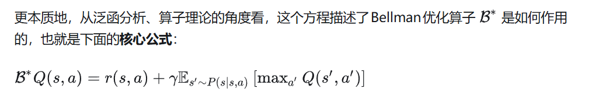

**价值函数：状态价值函数+动作价值函数**

状态价值函数：

$$
V^\pi(s) = \mathbb{E}_\pi[G_t | S_t = s]
$$

动作价值函数：
$$
Q^\pi(s, a) = \mathbb{E}_\pi[G_t | S_t = s, A_t = a]
$$

马尔科夫过程的贝尔曼方程
$$
V(s) = r(s) + \gamma \sum_{s' \in S} p(s' | s) V(s')
$$
r(s)是即时奖励；V(s)是价值函数；G(t)是累积奖励

**贝尔曼公式的提取公因式形式：**
$$
\begin{align*}
v_{\pi}(s) &= \mathbb{E}[R_{t+1}|S_t = s] + \gamma \mathbb{E}[G_{t+1}|S_t = s], \\
&= \sum_{a} \pi(a|s) \sum_{r} p(r|s,a)r + \gamma \sum_{a} \pi(a|s) \sum_{s'} p(s'|s,a)v_{\pi}(s'),  \\
&= \sum_{a} \pi(a|s) \left[ \sum_{r} p(r|s,a)r + \gamma \sum_{s'} p(s'|s,a)v_{\pi}(s') \right], \quad \forall s \in S.
\end{align*}
$$

第2种形式

$$
\begin{aligned}
V^\pi(s) &= \mathbb{E}_\pi[R_t + \gamma V^\pi(S_{t+1}) | S_t = s] \\
&= \sum_{a \in A} \pi(a|s) \left( r(s, a) + \gamma \sum_{s' \in S} p(s' | s, a) V^\pi(s') \right)
\end{aligned}
$$

贝尔曼方程Action-Value形式

$$
\begin{aligned}

Q^\pi(s, a) &= \mathbb{E}_\pi[R_t + \gamma Q^\pi(S_{t+1}, A_{t+1}) | S_t = s, A_t = a] \\
&= r(s, a) + \gamma \sum_{s' \in S} p(s' | s, a) \sum_{a' \in A} \pi(a' | s') Q^\pi(s', a')
\end{aligned}
$$

估值函数

价值函数=状态价值函数+动作价值函数

策略=input state+output action=输出一个概率分布

#### 策略梯度定理：

PG(Policy Gradient) 优化目标
$$
\mathbb{E}_{\pi_\theta} \left[ \nabla_\theta \log \pi_\theta(y_t|x_t) \hat{R}_t \right]
$$
策略的梯度
$$
\nabla_\theta J(\theta)=\nabla_{\theta} \log \pi(a|s; \theta)
$$

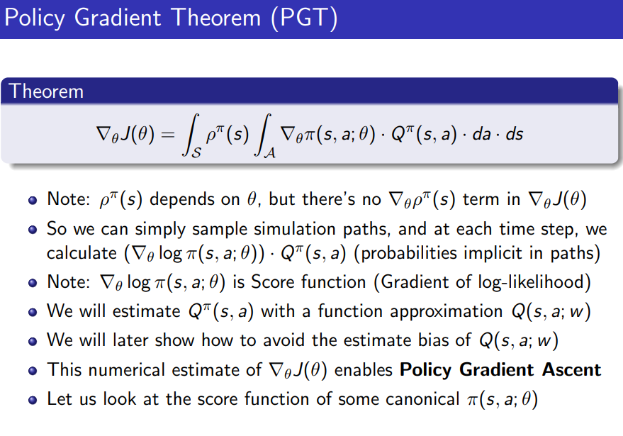

$$
G_t = R_{t+1}+{\gamma}R_{t+2}+{\gamma}^2R_{t+3}...
$$

$$
v_\pi(s)=E[G_t|S_t=s]
$$

$v_\pi$的值跟当前状态有关；
$$
\begin{aligned}
v_{\pi}(s) & =\mathbb{E}[G_t|S_t=s] \\
 & =\mathbb{E}[R_{t+1}+\gamma G_{t+1}|S_t=s] \\
 & =\mathbb{E}[R_{t+1}|S_t=s]+\gamma\mathbb{E}[G_{t+1}|S_t=s]
\end{aligned}
$$

Action Value函数

#### 3.Bellman公式；

对于贝尔曼公式来说，策略 π 是给定的
$$
v = r_{\pi} + \gamma P_{\pi} v_{\pi}
$$

### Course3 （2025.7.2）

#### Bellman最优公式（BOE）；

$ v(s) = \max_{\pi} \sum_{a} \pi(a|s) \left( \sum_{r} p(r|s,a)r + \gamma \sum_{s'} p(s'|s,a)v(s') \right) $

括号内的第一项是已知的；第二项$s'$是未知的；

矩阵形式：
$$
v = \max_{\pi} (r_{\pi} + \gamma P_{\pi} v)
$$

最优策略的定义：所有状态的Action Value都是最大的；

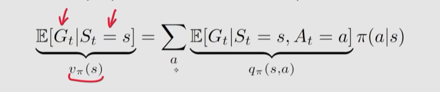

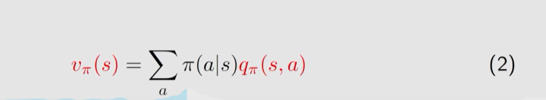

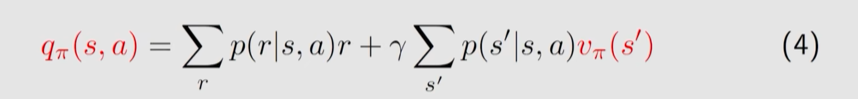

action求平均得到state value；

反过来，action value可以由state value求得；

##### TODO: 求解Bellman公式；

#### Optimal Policy (Course 3.2)

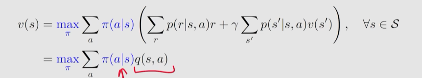

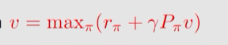

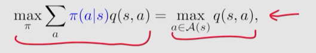

可以推导得到最优策略是：每个q(s,a)对应的最优a即是策略最优的a。

修改gamma参数会产生短视问题；

v的线性变换不会改变最优策略；

### Course 4 值迭代和策略迭代 (7.10)

两者即表示在同一个算法的一二步；也表示两个算法：值迭代算法和策略迭代算法；

策略迭代算法第一步是策略迭代；值迭代算法第一步是值迭代；

1.策略迭代
$$
\pi_{k+1} = \arg \max_{\pi} (r_{\pi} + \gamma P_{\pi} v_k)
$$

$$
\text{element wise form:} \\
\pi_{k+1}(s) = \arg \max_{\pi} \sum_{a} \pi(a|s) \left( \sum_{r} p(r|s, a)r + \gamma \sum_{s'} p(s'|s, a)v_k(s') \right), \quad s \in \mathcal{S}
$$

$$
q_k(s, a) = 括号内的项
$$

2.值迭代
$$
v_{k+1} = r_{\underline{\pi_
{k+1}}} + \gamma P_{\pi_{k+1}} v_k
$$
state value $v_{\pi_{k+1}}$

Q:如何证明策略迭代会到到最优策略

3.Policy Iteration只是一种理论算法，因为它要算无穷多步估计v;实际是truncated policy iteration；

4.总结

Value Iteration=policy update + value update

Policy Iteration=Policy evaluation+policy improvement

Value Iteration:
$$
\begin{cases} 
\text{Policy update: } \pi_{k+1} = \arg \max_{\pi} (r_{\pi} + \gamma P_{\pi} v_k) \\
\text{Value update: } v_{k+1} = r_{\pi_{k+1}} + \gamma P_{\pi_{k+1}} v_k 
\end{cases}
$$
Policy Iteration:
$$
\begin{cases} 
\text{Policy evaluation: } v_{\pi_k} = r_{\pi_k} + \gamma P_{\pi_k} v_{\pi_k} \\
\text{Policy improvement: } \pi_{k+1} = \arg \max_{\pi} (r_{\pi} + \gamma P_{\pi} v_{\pi_k}) 
\end{cases}
$$

### Course 5 蒙特卡罗方法（8.9）

**1.**

Policy Iteration和Value Iteration称为Model Based 方法；

或称Dynamic Programming

1）.简单蒙特卡洛方法 MC Basic

2）.MC Exploring Starts方法

3）.MC ε-Greedy方法

思考：根据大数定律可以得到平均值逼近真实期望，但是这个N导致的偏差如何估计？以及如果是比较复杂的分布是不是更难估计？

state value， action value实际上就是期望；

**2.MC Basic Algorithm**

​	根据多个episode估计action value平均值：

$$
q_ {\pi_k} (s, a) =  \mathbb{E}[G_t|S_t=s, A_t=a] \approx \frac{1}{N} \sum _ {i=1} ^N g^ {(i)} (s, a)
$$
​	MC方法是Model-Free的方法，但它是基于Model-Based方法的；没有模型则需要有数据；

​	MC Basic的第二步的策略Iteration的第二步（Policy Improvement）一样；

**3.MC Exploring Starts Algorithm**

​	随机选择s，a生成长度为T的episode；迭代N次；

​	为了提高效率，从后往前计算g用到action value；

**4.Soft Policy**

​	随机策略；

$$
\pi (a|s)= \left\{ \begin{array}{ll}
1-\frac{\varepsilon}{|\mathcal{A}(s)|}(|\mathcal{A}(s)|-1), & \text{ for the greedy action, } \\
\frac{\varepsilon}{|\mathcal{A}(s)|}, & \text{ for the other }|\mathcal{A}(s)|-1 \text{ actions. }
\end{array} \right.
$$
​	explotation（充分利用）和exploration（探索）

​	可以使得相同的步数下探索的空间更大；

episode和trajectory

**Episode** 指的是从环境的初始状态开始，智能体与环境进行交互，直到达到一个终止状态（terminal state）的完整过程。在这个过程中，智能体采取一系列动作（actions），环境根据这些动作返回新的状态（states）和奖励（rewards）。

### Course 6 随机近似与随机梯度下降（8.11）

**1.example**

平均值期望的两种方法：累加值计算平均；增量值计算平均；
$$
 w_{k+1} = \frac{1}{k} \sum_{i=1}^{k} x_i, \quad k = 1, 2, \ldots
$$

$$
w_{k+1} = w_k - \frac{1}{k}(w_k - x_k)
$$

增量平均	是一种stochastic approximation算法；

2）**Robbins-Monro 算法（RM算法，非常经典）**

3）随机梯度下降 SGD

4）BGD, MBGD, SGD

#### 6-2 6-3.Robbins-Monro算法

**RM算法**

​	在满足RM算法三个条件的情况下，以下方法可以得到最终方程g(w)=0的根：

​	$w_{k+1} =  w_k -a_k \tilde{g}(w_k, \eta_k)$

​	$\eta_k$是噪声；$w$是无穷逼近的极限；$\tilde g$是噪声观测的函数；

拓展：几乎处处收敛的测度论性质；

​	$w_{\infty} - w_1 = \sum_{k=1}^{\infty} a_k \tilde{g}(w_k, \eta_k).$

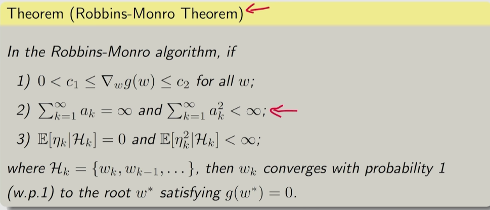

Dvoretzky 定理（**）

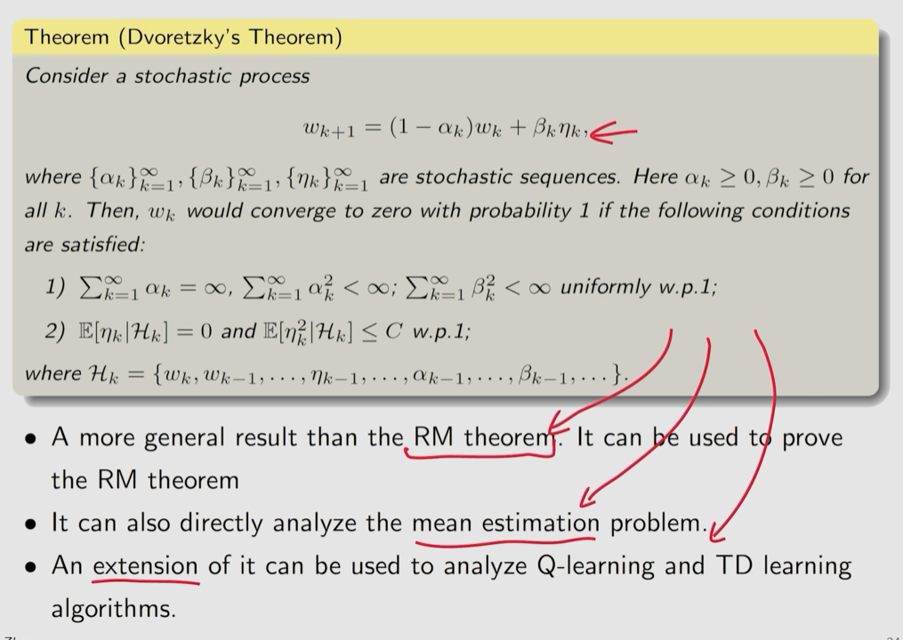

#### 6.4 Gradient Descendant的几种方法

GD -> BGD -> SGD

Stochastic 梯度下降不需要多次采样，但是会有随机性；
$$
w_{k+1} = w_k - \alpha_k \nabla_w \mathbb{E}[f(w_k, X)] = w_k - \alpha_k \mathbb{E}[\nabla_w f(w_k, X)]
$$

$$
\nabla_w f(w_k; x_k) = \mathbb{E}[\nabla_w f(w, X)] + \underbrace{\nabla_w f(w_k, x_k) - \mathbb{E}[\nabla_w f(w, X)]}_{\eta}
$$

​	令$$ \tilde{g}(w, \eta) = \nabla_w f(w, x) $$，则可以用RM算法判断收敛性；

​	A = E + A - E；

**收敛性**

​	在w离w*(最优参数)远的时候，随机性比较小（会向目标进行运动）；而近的时候，随机性比较大；这个随机性是用梯度的相对误差来衡量的；（即梯度差除以随机梯度的值）

​	用X代表参数值，代表从数据集中进行采样训练的操作（就是常见的SGD算法）；
$$
\min_w \quad J(w) = \frac{1}{n} \sum_{i=1}^n f(w, x_i) = \mathbb{E}[f(w, X)]
$$

**MBGD**

​	MiniBatch的抽取是有放回的抽取；

### Course 7 时序差分方法（TD方法）

temporal-diff learning

TD算法的更新公式：（只更新一个值）
$$
\begin{aligned}
    v_{t+1}(s_t) &= v_t(s_t) - \alpha_t(s_t) \Big[ v_t(s_t) - \big[ r_{t+1} + \gamma v_t(s_{t+1}) \big] \Big]; \quad &(1) \\
    v_{t+1}(s) &= v_t(s), \quad \forall s \neq s_t, \quad &(2)
\end{aligned}
$$
重要概念TD Target：$$\bar{v_t}$$；$$v_{t+1}(s_t) \text{比} v_t(s_t)更接近 \bar{v_t}$$
$$
v_{t+1}(s_t) = v_t(s_t) - \alpha_t(s_t) \big[ v_t(s_t) - \bar{v}_t \big]
$$

TD算法归类：1.只计算Vaue，2.不估计最优策略

#### 7-2 TD算法和MC算法对比

TD算法是online的；bootstrapping的；方差小；

MC算法是每个episode更新的；不是bootstrapping的；方差大；

#### 7-3 Sarsa算法

用action value（即q(s,a))描述Bellman方程
$$
q_\pi(s, a) = \mathbb{E} \left[ R + \gamma q_\pi(S', A') | s, a \right], \quad \forall s, a
$$
Sarsa算法=experience收集+q-value更新+policy更新

#### 7-4 Expected-Sarsa和n-step Sarsa

$$
\mathbb{E}_{A_{t+1} \sim \pi(S_{t+1})}\left[ q_{\pi}(S_{t+1}, A_{t+1}) \right]; \\

\mathbb{E}[q_t(s_{t+1}, A)] = \sum_a \pi_t(a|s_{t+1}) q_t(s_{t+1}, a)
$$

$$
q_{\pi}(s, a) = \mathbb{E}\left[ R_{t+1} + \gamma \mathbb{E}_{A_{t+1} \sim \pi(S_{t+1})}\left[ q_{\pi}(S_{t+1}, A_{t+1}) \right] \middle| S_t = s, A_t = a \right], \quad \forall s, a
$$

**n-step sarsa**
$$
q_\pi(s, a) = \mathbb{E}[G_t^{(n)}|s, a] = \mathbb{E}[R_{t+1} + \gamma R_{t+2} + \cdots + \gamma^n q_\pi(S_{t+n}, A_{t+n})|s, a].
$$
特性：

n=1，n-step sarsa是sarsa算法；

n=无穷，则它变成了蒙特卡洛算法；

前置知识：action value对动作加权求和得到state value；

#### ⭐7-5 -> 7-8 Q-Learning（8.21，8.22，8.23）

不同于策略评估和improvement，直接计算最优的action value，它是一种数据驱动的方法；

​	公式（1）
$$
\begin{cases}
q_{t+1}(s_t, a_t) = q_t(s_t, a_t) - \alpha_t(s_t, a_t) \left[ q_t(s_t, a_t) - \left[ r_{t+1} + \gamma \max_{a \in \mathcal{A}} q_t(s_{t+1}, a) \right] \right] \\
q_{t+1}(s, a) = q_t(s, a), \quad \forall (s, a) \neq (s_t, a_t),
\end{cases}
$$

回顾：SGD，TD Target和TD Error，TD算法

2.**两个策略**

behavior策略；

target策略；

on-policy vs off-policy：

off-policy的好处：可以搜索其他策略的更优方法；

Sarsa和Monte-Carlo都是**on-policy方法**

3.**Q-Learning是off-policy** 

Q-Learning的BOE（最优方程）不涉及策略；

可以强行让Q-Learning的两个policy一致，即变成了特殊情况On-Policy结果；

📍注1：Q-Learning估计Q(s', a')的时候会把所有的a'都扫描一边，取最大的a'作为估计；但是它并不一定真的在下一步会执行a'；而SARSA估计和实际执行的就是一个a；

### Course 8 值函数近似

从表格到函数

目标：给定策略，求w使得$\hat{v}_\pi(s,w)$和$v_\pi(s)$（TODO?)

参数和特征（s是特征变量，w是参数）
$$
\hat{v}(s, w) = \phi^T(s) w
$$

引入平稳分布和马尔科夫链（转移概率）估计每个状态的概率，进而定义最优策略的指标（reward求和）；

对目标函数（损失）求其值；
$$
J(w) = \mathbb{E} [ (v_\pi(S) - \hat{v}(S, w))^2 ] = \sum _ {s \in \mathcal{S}} d_\pi(s)(v_\pi(s) - \hat{v}(s, w))^2.
$$
（NOTE: 公式（1）是什么意思？它是贝尔曼方程吗）

公式（1）
$$
\begin{aligned}
    w_{k+1} &= w_k - \alpha_k \nabla_w J(w_k) \\
    \text{The true gradient is} \\
    \nabla_w J(w) &= \nabla_w \mathbb{E}[(v_\pi(S) - \hat{v}(S, w))^2] \\
    &= \mathbb{E}[\nabla_w (v_\pi(S) - \hat{v}(S, w))^2] \\
    &= 2\mathbb{E}[(v_\pi(S) - \hat{v}(S, w))(-\nabla_w \hat{v}(S, w))]
\end{aligned}
$$

$$
w_{t+1} = w_t + \alpha_t (v_\pi(s_t) - \hat{v}(s_t, w_t)) \nabla_w \hat{v}(s_t, w_t),
$$
用$g_t$代替估计$v_\pi(s_t)$
$$
w_{t+1} = w_t + \alpha_t (g_t - \hat{v}(s_t, w_t)) \nabla_w \hat{v}(s_t, w_t).
$$

公式（2）TD方法的value更新算法（求解用）
$$
w_{t+1} = w_t + \alpha_t \left[ r_{t+1} + \gamma \phi^T(s_{t+1}) w_t - \phi^T(s_t) w_t \right] \phi(s_t),
$$

#### 8-4 直观的例子

没看懂：

True Value Error;

Projected Bellman Error;

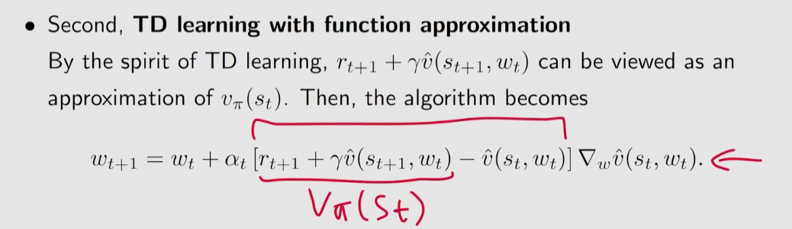

#### 8-5 Sarsa算法的函数估计

$$
\text{The Sarsa algorithm with value function approximation is} \\
w_{t+1} = w_t + \alpha_t \left[ r_{t+1} + \gamma \hat{q}(s_{t+1}, a_{t+1}, w_t) - \hat{q}(s_t, a_t, w_t) \right] \nabla_w \hat{q}(s_t, a_t, w_t)
$$

q-learning算法的函数估计
$$
w_{t+1} = w_t + \alpha_t \left[ r_{t+1} + \gamma \max_{a \in \mathcal{A}(s_{t+1})} \hat{q}(s_{t+1}, a, w_t) - \hat{q}(s_t, a_t, w_t) \right] \nabla_w \hat{q}(s_t, a_t, w_t)
$$

#### 8-6 ⭐ Deep Q-Learning=DQN

目标=最小化平方和
$$
J(w) = \mathbb{E} \left[ \left( R + \gamma \max_{a \in \mathcal{A}(S')} \hat{q}(S', a, w) - \hat{q}(S, A, w) \right)^2 \right]
$$

计算=main network+target network+梯度计算

NOTE:梯度计算是重点，因为它假设了R+\gamma(q)里的w是常数，但是没有解释为什么可以做此假设；

实现=w+w_t+replay buffer；

#### 8-7 经验回放（Experience Replay）

#### 8-8 Off-Policy版本的DQN

NOTE: **on-policy**的含义就是value update + policy update; **off-policy**只有value update没有policy update；

DQN里的神经网络的实际实现，只输入s而不输入(s,a)，输出（s，a）对的值；

DQN的off-policy版本：

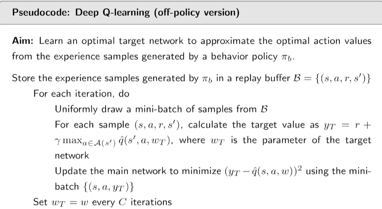

### Course 9 策略梯度方法

回顾：Value-Based 方法

#### 9-1 策略梯度方法与梯度下降

​	$$ \theta _ { t + 1 } = \theta _ { t } + \alpha \nabla _ { \theta } J ( \theta _ { t } ) $$

#### 9-2 Average Reward

确定$J(\theta_t)$的表达式

加权状态平均（metric 1）：
$$
\bar{v}_{\pi} = \sum_{s \in \mathcal{S}} d(s) v_{\pi}(s)
$$
$$v_{\pi}(s) \in R^{|S|} $$， 是从初始分布 s 开始的折扣累计回报（state-value）；

d(s)如何定义？

​	初始状态是平稳分布状态的概率；$d(s)=Pr(S_0=s)$ (?)

​	初始分布 $d(s)$：不依赖于策略

​	折扣访问分布 $d_\pi(s)$：依赖于策略

#### 9-3 average one-step reward

$d_{\pi}(s) $是策略下的稳态分布（即状态s的平稳概率）

metric 1: 是从折扣累计回报（state-value）；
$$
\bar{r}_{\pi} \doteq \sum_{s \in \mathcal{S}} d_{\pi}(s) r_{\pi}(s) = \mathbb{E}[r_{\pi}(S)]
$$

 $r_{\pi}$的性质
$$
\begin{aligned}
    \lim_{n \to \infty} \frac{1}{n} \mathbb{E} \left[ \sum_{k=1}^{n} R_{t+k} | S_t = s_0 \right] &= \lim_{n \to \infty} \frac{1}{n} \mathbb{E} \left[ \sum_{k=1}^{n} R_{t+k} \right] \\
    &= \sum_{s} d_{\pi}(s) r_{\pi}(s) \\
    &= \bar{r}_{\pi}
\end{aligned}
$$
**metric 2:** $v_{\pi}$考虑return；而$v_{\pi}$更加短视；但是这两者是等价的（线性关系）；（为什么？）

​	等价关系如下：
$$
\bar{r}_{\pi} = (1 - \gamma) \bar{v}_{\pi}
$$

$\bar{v}{_\pi}$的等价表示：
$$
J(\theta) = \mathbb{E} \left[ \sum_{t=0}^{\infty} \gamma^t R_{t+1} \right]=\bar{v}_\pi
$$

强化学习中，如何证明策略梯度的两个metric的对应公式：
$$
\sum_{s} d_{\pi}(s) r_{\pi}(s)=(1 - \gamma)\sum_{s} d(s) v_{\pi}(s)=(1-\gamma)
E\left[ \sum_{t=0}^{\infty} \gamma^t R_{t+1} \right]
$$

#### 9-4 Gradient of the metrics

$$
\begin{align*}
\nabla_{\theta}J(\theta) &= \sum_{s \in \mathcal{S}} \eta(s) \sum_{a \in \mathcal{A}} \nabla_{\theta}\pi(a|s, \theta)q_{\pi}(s, a) \\
&= \mathbb{E}[\nabla_{\theta} \ln \pi(A|S, \theta)q_{\pi}(S, A)]
\end{align*}
$$

具体推导见下；

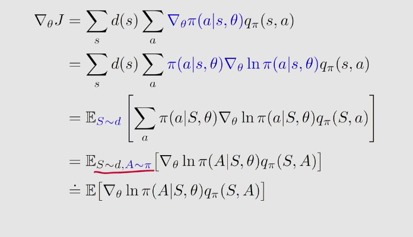

#### ⭐9-5 Gradient-ascent algorithm(REINFORCE)

分类: Offline

算法公式：
$$
\begin{aligned}
\theta_{t+1} &= \theta_t + \alpha \nabla_\theta \ln \pi(a_t|s_t, \theta_t) q_t(s_t, a_t) \\
&= \theta_t + \alpha \underbrace{\left(\frac{q_t(s_t, a_t)}{\pi(a_t|s_t, \theta_t)}\right)}_{\beta_t} \nabla_\theta \pi(a_t|s_t, \theta_t).
\end{aligned}
$$
注意$\beta_t$，它是用来控制策略$\pi$的action概率的分布的；

1. 原始公式：

$$
\theta_{t+1} = \theta_t + \alpha \nabla_\theta \ln \pi(a_t|s_t, \theta_t) q_\pi(s_t, a_t)
$$

2. 替换后的公式：

$$
\theta_{t+1} = \theta_t + \alpha \nabla_\theta \ln \pi(a_t|s_t, \theta_t) q_t(s_t, a_t)
$$

​	下标改变；

因为是offline，所以每个trajectory的参数更新只有一次 $\theta_k=\theta_{T}$

#### Rollout

有了这个直观的理解，我们回顾下 PPO 的粗略工作流程。注意，actor 在 RLHF 会进行 auto-regressive decoding，而 critic, reward 和 reference 则只会 prefill，不会 decode。所以，我们将 actor 的推理特定称为 rollout，而其他模型的推理称为 inference。https://zhuanlan.zhihu.com/p/24682036412

在verl里，group sampling=group rollout，可以参见verl的grpo_trainer.README

### Course 10 Actor Critic(10.9,10.10)

#### 10-1 QAC

actor critic是一种策略梯度

1. 回顾梯度上升算法

$$
\begin{split}
\theta_{t+1} &= \theta_t + \alpha \nabla_\theta J(\theta_t) \\
&= \theta_t + \alpha \mathbb{E}_{S \sim \eta, A \sim \pi} \left[ \nabla_\theta \ln \pi(A|S, \theta_t) q_\pi(S, A) \right]
\end{split}
$$

**如何得到$q_t(s_t, a_t)$?(即action value)**

​	Monte Carlo Policy Gradient即REINFORCE

#### 2.QAC算法

​	主要的Critic和Actor

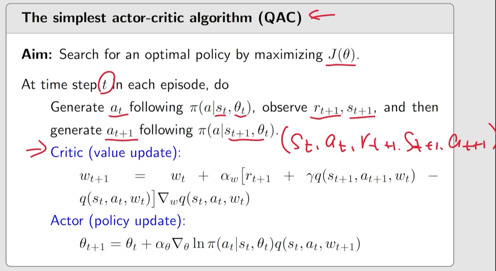

#### 3. Advantages Actor Critic(AAC = A2C) 又名TD Actor Critic

策略梯度方法中，action value（q）减掉一个基线，期望不变；

方差受其影响

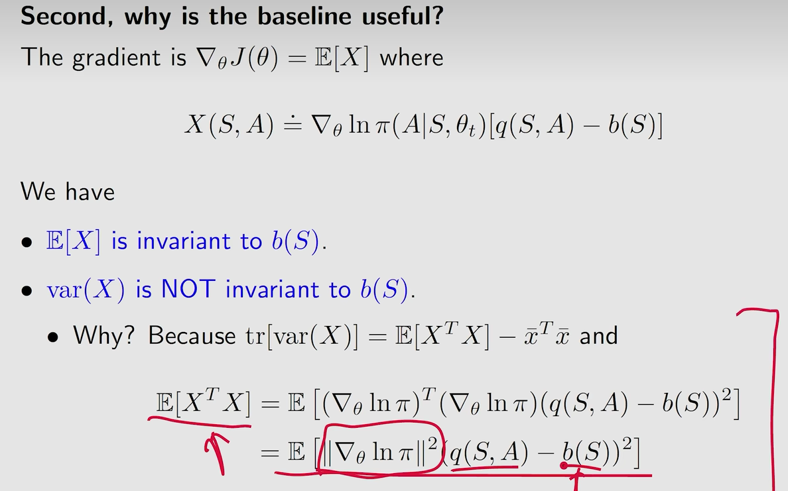

先转成因为X方差的trace=，得到最终式子中b有关；

**在b(S)一致的情况下如何减小X的方差？**

理论最优baseline：
$$
b^*(s) = \frac{\mathbb{E}_{A \sim \pi} [\|\nabla_{\theta} \ln \pi(A|s, \theta_t)\|^2 q(s, A)]}{\mathbb{E}_{A \sim \pi} [\|\nabla_{\theta} \ln \pi(A|s, \theta_t)\|^2]}.
$$

次优baseline：
$$
b(s) = \mathbb{E}_{A \sim \pi} [q(s, A)] = v_{\pi}(s)
$$

TD Error

​	$$\delta_t=r_{t+1}+\gamma{v}(s_{t+1}, w_t)-v(s_t, w_t)$$

#### 4.重要性采样与Off-Policy Actor Critic

​	怎么把On-Policy采样转成其Off-Policy？	

​	用Importance Sampling；
$$
\mathbb{E}_{X \sim p_0}[X] 
$$
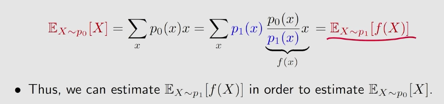

$$\frac{p_0(x_i)}{p_1(x_i)}$$重要性采样(从一个分布得到另外一个分布的期望，可以用在任意分布和离散期望求解）

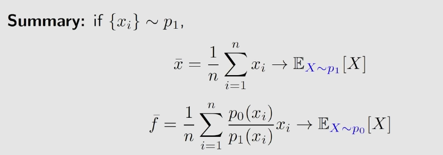

用重要性采样优化梯度上升方法

​	target policy；behavior policy；

如何估计E_{x=x0}[X]

例子：

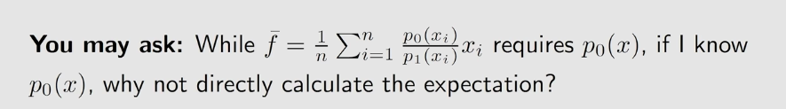

​	神经网络的输出概率要拿来算期望；

​	确定性策略下q和E的计算；

**重要概念：**

​	On-Policy, Off-Policy；用梯度、action函数、期望判断On-Off；用behavior policy和target policy判断On-Off；

​	什么叫Actor Critic；

#### 5.Determinstic Policy Gradient

#### References

**Resource Needed for verl RL(LoRA)** https://verl.readthedocs.io/en/latest/perf/device_tuning.html

