官网：

https://sites.cs.ucsb.edu/~lingqi/teaching/games101.html

#### 作业系统链接

https://games-cn.org/submit_homework/

https://games-cn.org/forums/topic/allhw/

https://github.com/liupeining/Games_101/tree/main

GAMES101、202作业、课件、虚拟机

百度网盘：https://pan.baidu.com/s/1ttFTBF_Bk7eN6X3DE4ca0Q?pwd=void

谷歌网盘：https://drive.google.com/drive/folders/10Z_GCxwN-k3GvdbDj0nzh8dx6BRPqfk2?usp=sharing

#### 2026.4.17 开始学习Games 101 第4节课

感觉没有那么难。

是我的错觉吗。

也可能是之前已经学习过了。

#### 2026.4.20 Games 101 第5节课

Rasterization 1

始终把相机移动到原点。

**Frustum** 视锥体

光栅化成像；

#### 2026.4.27 Games 101 Course 6

Rasterization 2

Antialiasing and Z-Buffering 反走样

走样：同一个函数，采样了两个不同频率，得到的结果偶然地完全一样的现象；

滤波=去掉频率 or 卷积 （=averaging）

滤波器=窗口=滑动窗口

Spatial Domain, Frequency Domain

​	在某个条件下，Spatial Domain的乘积=频域的卷积

a * b = F_inv(F(a) x F(b))

为什么这里也有傅里叶变换

#### Sampling

本质=重复原始信号的频谱

#### Anti-Aliasing

反走样

（非常直观的推导，但是没有数学解释）

模糊的方法：用一个卷积块进行卷积

Anti-Aliasing By SuperSampling

MSAA:多重采样抗锯齿，Multi-Sample Anti-Aliasing

- **关键区别**：MSAA **不会** 为每一个子采样点单独运行一次像素着色器。它会问：“在这个像素内，所有被覆盖的采样点，它们的颜色是否相同？”
- **相同颜色**（像素内部）：像素着色器只运行一次，结果输出给所有被覆盖的采样点。
- **不同颜色**（像素边缘）：只对**每个不同的图元**运行一次着色器，结果共享给属于该图元的采样点。

**第四步：解析（Resolve）**

- 所有三角形渲染完毕后，显卡会计算每个像素的**最终颜色** = 所有子采样点颜色的平均值。
- 在上面的例子（3个三角色采样点 + 1个背景色采样点）中，最终颜色 = (三角色×3 + 背景色×1) / 4。
- 这会产生一个介于三角形和背景之间的**中间色**，人眼看起来就是平滑的渐变边缘。

其他抗锯齿：FXAA，TAA（广泛应用⭐）

深度学习超分辨率：

(DLSS/Deep Learning Super Sampling)

#### 2026.4.28 Games 101 第6节课

z-buffer里如何解决三角形深度完全相同的情况

ambient lighting

diffusion reflection 漫反射；漫反射是均匀的

Lambertian Shading

漫反射=反射系数+光线衰减+夹角投影

作业2

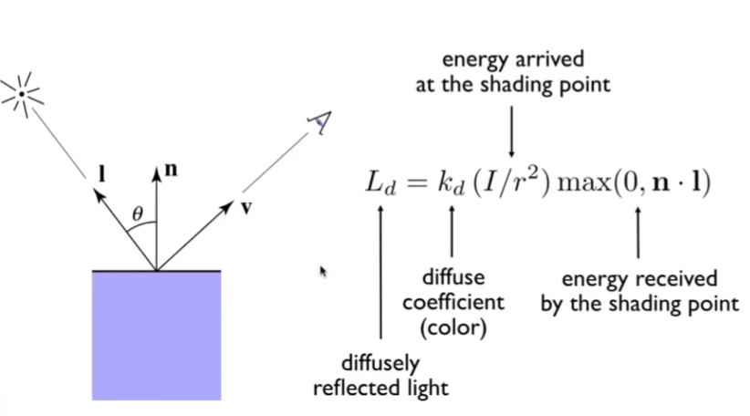

#### 2026.4.29 

光源方向，视线方向，法线方向

问题：无法理解shading point；

#### 2026.5.9 Lecture 08 Shading 2

**1.Blinn-Phong模型**

光照L=漫反射+环境光照+高亮反射

Ambiend+Diffuse+Specular

(Fake)

**扩展：**全局光照（非常难）；

**2.Phong Shading**

着色频率；应用在三角形、像素（通过法线和计算插值得到shading结果）

Flat-Shading；Gouraud；

- 求一个顶点的法线

Face，Vertex，Pixel；

顶点（Per-Pixel) Normal Vectors；各个面的发法线的平均；

**3.图形渲染管线**

Vertex Processing

->Triangle Processing

->Rasterization

->Fragment Processing (Z-Buffer Visibility)

->Framebuffer Operations

OpenGL的GLSL着色器；

DirectX；

Vulkan；

- 在线渲染网站 Snail Shader Program;

4.**Texture Mapping 纹理映射**

⭐Parameterization：如何让展开的图片的颜色映射跟展开前的映射是无缝衔接的

#### 5.10 Course 10

Barycentric coodinates

$$
P = \alpha A + \beta B + \gamma C重心坐标（重心坐标不是重心）
$$

​	投影坐标下，是任意投影的；

​	由于重心坐标投影变化下不能保证不变，所以	三维空间中的属性，需要在三维空间中插值，再投影到二维里；

**Texture queries**

​	Texture Magnification：纹理放大；

​	Pixel，Texel；

​	纹理是指已经着色的二维图像

- 双线性插值 = 在二维网格上先水平方向插值，再垂直方向插值。
- （无法理解）

​	Point Query；Range Query（给定范围求平均值）；

- 无法理解；

​	Mipmap算法：快速，近似，方形的范围查询；

（L. Williams）Image Pyramid

​	共有log2 L层的额外存储；额外存储的总空间占用是1/3。

​	通过计算纹理层上的最大的长度，计算得到应该在哪一层做查询；

​	如果层算出来是非整数，那么直接做双线性插值。这个就是三线性插值。

​	空间的三角形 vs 纹理的三角形

3.3 Overblur问题

Anisotropic Filtering：各向异性过滤；

EWA Filtering：多次查询，花费更多；

3.4 纹理

Application of Textures

#### 2026.5.12 Games 101 Course 10 Geometry

Shading 1 & 2

- Blin-Phong reflectance model

- Shading models / frequencies

- Graphics Pipeline
- Texture mapping

Shading 3

- Barycentric coordinates
- Texture antialiasing (MIPMAP)
- Applications of textures

1. Applications of Texture 纹理的应用

环境光照；（=环境贴图，环境映射）

​	Utah 茶壶；Stanford Rabbit；Dragon；Cornell Box;

环境光的设置方法

方法1：Spherical Map 球面展开；

- 问题：扭曲

方法2：cube map展开，没有扭曲

- 问题：缺失；

凹凸贴图（法线贴图）Bump Mapping

​	可以通过假的着色方式构造一个模拟的凹凸纹理；

- 不影响集合

flatland

3D空间的法线贴图（凹凸贴图）：

推导：求出扰动后的法线：（-dp/du, -dp/dv, 1).normalized()

- 问题：阴影不对；边缘不对；

位移贴图（Displacement Mapping）

- 好处：更加真实
- 局限：三角形需要足够细；比纹理频率要高；

Ambient Occulusion texture map

几何建模：

​	几何不是一个简单的东西；

Implicit Geometry: 通过方程表示的几何

​	x^2 + y^2 + z^2 = 1 方程；

Explicit Geometry：

- 三角形面

- 参数映射；

- **显式表示**：直接给出点的坐标（参数形式），或直接列出所有点（多边形网格）。**容易采样，但难以判断一个点是否在形状内部。**
- **隐式表示**：给出一个方程或函数，规定满足该方程的点在形状上。**容易判断点是否在内部，但难以直接枚举所有点。**

Constructive Solid Gemoetry (Implicit) CSG

​	多个基本元素的组合；

Distance Functions (Implicit)

Blend函数（？？？讲解存疑）

​	Blend(SDF(A), SDF(B))

​	融合距离函数是什么意思；

​	符号距离函数是一种对空间的数学描述。对于空间中的任意一点 p，SDF(p)的返回值表示：

- 该点到物体表面的**最短距离**，
- 并用**正负号**表示点在物体**外部**（+）还是**内部**（-）。

Level-Set Method（Implicit）

​	通过插值得到相同值的时候提取出平面；

Fractals（Implicit) 分形；

​	会造成强烈的走样；

AI Idea 简单的方法：

​	如何证明你的方法是正确的；

#### 2026.5.12 Games 101 Course 11 Geometry 2

1.Point Cloud

2.Polygon Mesh 多边形

- Wavefront object obj格式

顶点；每个顶点的法线和纹理坐标；

3.贝塞尔曲线

de Casteljau Algorithm

贝塞尔曲线的性质：控制点在仿射变换下，得到的曲线不变；

Bernstein多项式；

逐段贝塞尔曲线；（fonts, paths, Illustrator, Keynote)；

C1连续（一阶导）：$$an=b0=1/2(a_{n-1} + b1)$$

4.Other types of splines（样条）

B-splines：不需要分段且支持多个点就能实现局部改变；

（B样条有点复杂）NURBS

模型例子：贝塞尔曲面 Gumbo Model

怎么做贝塞尔曲面且拼接的时候严丝合缝

Q: 生成四个曲线，在网格里维度y（x亦可）的某个值做第一次插值的时候得到四个点，这四个点又构成曲线；

这也就意味着曲线确定之后，贝塞尔曲面也确定了；

（作业3）

#### 2026.5.18 Games 101 Course 12 Geometry 3

T/N/B 计算；

Ed Catmull;

Ravi Ramamoorthi

Subdivision；

​	Loop Subdivision：（Loop是人名）

Catmull-Clark Subdivision:

​	No-quad face

​	Extraordinary vertex（奇异点）

​	vertex（degree != 4)

​		只有第一次可能有非四边形面；所以只会在第一次的时候增加奇异点；

​	Face point; Edge point; Vertex Point;

Simplification；

#### 3.Mesh Simplification

​	减少mesh元素的个数；

Quadric Error Metrics（二次误差度量）

​	对于多个面，找到一个点，使得新顶点跟原来各个点的距离平方和最小；

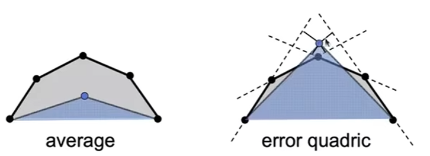

​	如何坍缩一个边：

- 用一个优先队列
- 贪心算法

#### Shadow Mapping

​	实时光线追踪。

​	如何处理一个点光源投射后的渲染；

​	不在阴影的点则能被光看到和相机看到；

​	数值精度问题导致Shadow Mapping有偏差；

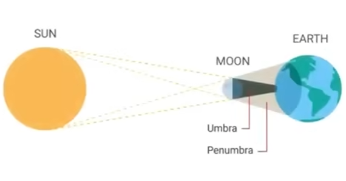

Umbra：本影

Pernumbra：半影

点光源不可能出现软阴影（半影）；

光栅化里用了 **Z-Buffer** 去解决**遮挡/可见性问题**（即哪个像素显示哪个物体）。
而光追仅仅使用**光线与场景求交（Ray-Scene Intersection）**就达到了**全局光照及正确的遮挡关系**（或简单说“自然的光照与阴影”）。

Recursie (Whitted-Style) Ray Tracing

​	一个像素的渲染结果来自于所有光线的反射和折射后汇总的结果；

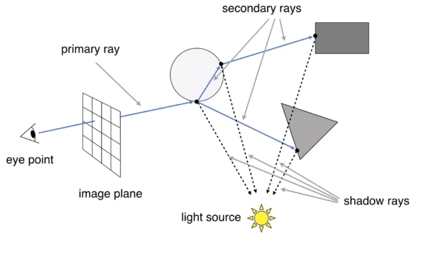

Ray-Surface Intersection

- 从点 P向任意方向发一条射线（例如沿 +x 方向）。
- 计算射线与曲面 S的交点个数（解方程）。
- **奇偶规则**：奇数个交点 → 内部；偶数个交点 → 外部（要处理相切、射线经过顶点等退化情况）。

两种方法求光线和平面的交点：

1.给定法向量和平面解方程；

2.给定三个点用Moller Trumbore算法

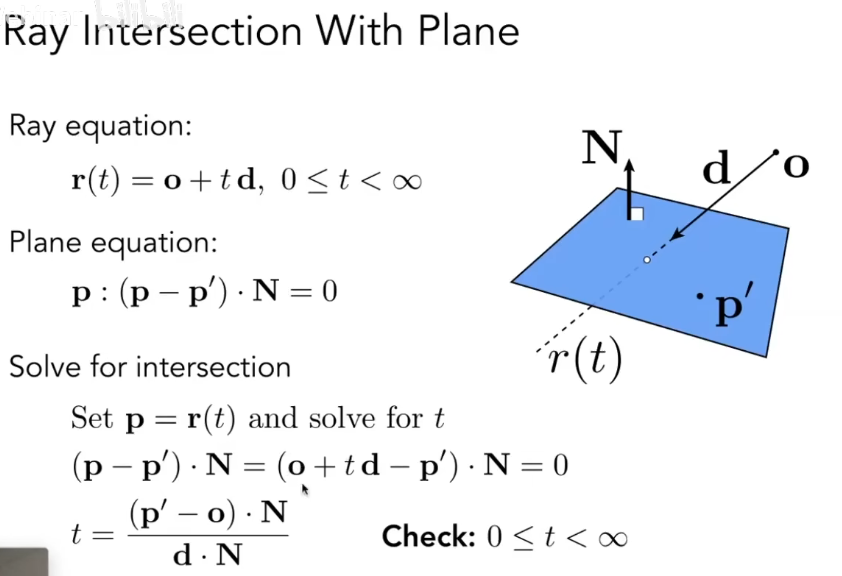

（作业3）

#### 2026.5.21 Games 101 Course 13 Ray Tracing 1

Axis-Aligned Bouding Box(AABB)

t_{min}指不同的坐标上交点对应的时间的最小值；

$t_{enter}=max\{t_{min}\}$

$t_{exit}=min\{t_{max}\}$

2D情况下的在光线内部的时间：求两个光线的交集；

三种情况：盒子在光线后面；光线的起点在盒子里面；盒子在光线前面；

slabs perpendicular to x-axis

#### 2026.5.21 Games 101 Course 14 Ray Tracing 2

GTC DLSS 2.0

实时的全局光照是怎么做的；

⭐如何光栅化一条直线；

均匀网格的问题：浪费

~~~
所以现代光追更常用：

BVH
KD-Tree
Octree
Uniform Grid

其中 BVH 是现在实时光追和离线渲染里非常主流的结构。
~~~

##### Spatial Partitions

Oct-Tree

KD-Tree

BSP-Tree

根据KD-Tree的空间划分，从最顶层的包围盒开始，每次判定包围盒和光线是否有交点；如果有交点，则继续判断其子节点（子包围盒）跟光线是否有交点；如果没有交点，则无需继续遍历这个节点的子节点；否则继续遍历；

##### ⭐Object Partitions: Bounding Volumne Hierachy(BVH)

实时光线追踪

解决了：KD-Tree同一个物体出现在不同区域的问题；

引入了：空间内不严格划分的问题；

每个节点快速划分的复杂度O(n)

**Basic Radiometry （辐射度量学）**

从Blinn-Phong的问题开始讲起

illumination

Radiant flux, intensity, irradiance, radiance

Radiant Energy and FLUX

- Radiant flux：

​	$$\Phi \equiv \dfrac{\mathrm{d}Q}{\mathrm{d}t} \quad [\mathrm{W = Watt}] \quad [\mathrm{lm = lumen}]^*$$

- Radiant Intensity：单位角度发射的功率（坎德拉）

​	$$I(\omega) \equiv \dfrac{\mathrm{d}\Phi}{\mathrm{d}\omega}$$

​	$$\left[ \dfrac{\mathrm{W}}{\mathrm{sr}} \right] \quad \left[ \dfrac{\mathrm{lm}}{\mathrm{sr}} = \mathrm{cd} = \mathrm{candela} \right]$$

- Inrradiance：接收的能力

​	$E=\frac{\Phi}{\pi r^2}$

- Radiance：路径上的光线

- radians：弧度

- steradians：立体角
- 微分立体角：一个微分角跟$\theta$的公式

#### 2026.5.23 Games 101 Course 14 Ray Tracing 3

四个概念

在同心圆辐射下，intensity不变；irradiance会衰减；

Radiance

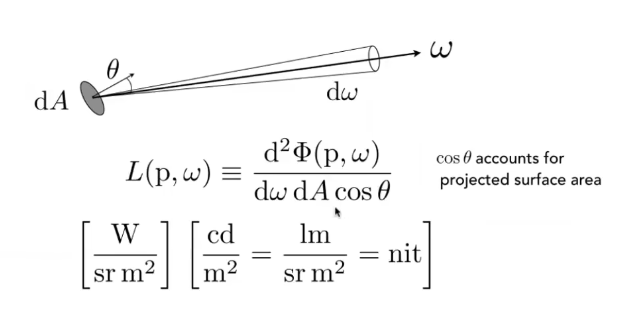

⭐等价概念：

Radiance: Irradiance per solid angle；

Radiance: Intensity per unit area;

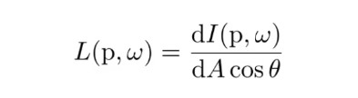

#### 1.BRDF

Bidirectional Reflectance Distribution Function

双向反射分布函数

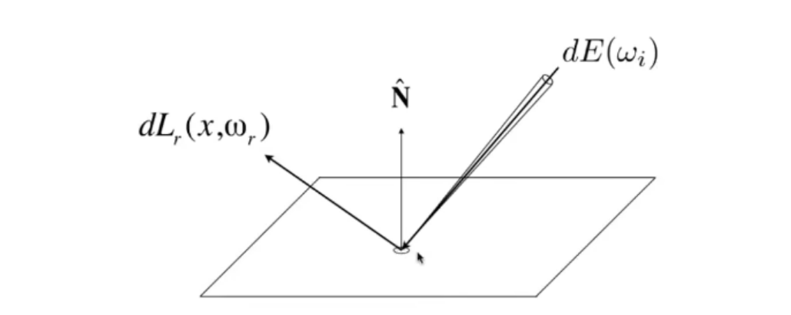

Differential irradiance incoming:    

​	$$dE(\omega_i) = L(\omega_i) \cos\theta_i d\omega_i$$

Differential radiance exiting (due to $dE(\omega_i)$):    $dL_r(\omega_r)$

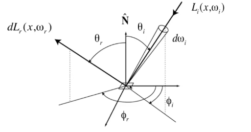

从某一个方向接收到的能量如何分配到其他方向（分配比例 f）

​	$${f}_{r}({\omega }_{i}\to {\omega }_{r})=\frac{\mathrm{d}{L}_{r}({\omega }_{r})}{\mathrm{d}{E}_{i}({\omega }_{i})}=\frac{\mathrm{d}{L}_{r}({\omega }_{r})}{{L}_{i}({\omega }_{i})\cos{\theta }_{i}\mathrm{d}{\omega }_{i}}\quad \left[\frac{1}{\mathrm{sr}}\right]$$

积分得到渲染方程：

​	$$ L_r(p, \omega_r) = \int_{H^2} f_r(p, \omega_i \to \omega_r) L_i(p, \omega_i) \cos\theta_i \, d\omega_i $$

🔥挑战：渲染方程的递归特点；

​	$$ I(u) = e(u) + \int I(v) K(u, v) \, dv $$ 

这是一个典型的**第二类Fredholm积分方程**，也是渲染方程（Rendering Equation）的抽象形式。

继续简写：

​	L = E + KL

- 复习概率论

随机变量函数的积分一定可以积分吗

#### 2026.5.25 Games 101 Course 14 Ray Tracing 4

作业6：已完成

蒙特卡洛积分
$$
\int f(x) dx = \frac{1}{N}\sum_{i=1}^N\frac{f(X_i)}{p{(X_i)}}
$$

#### Path Tracing

​	用蒙特卡洛积分算积分的函数；

- 因素2：直接光照和间接光照；
- 因素3：递归计算量指数增长；
- 因素4：递归停止方式

2）如果N != 1，则叫做分布式路径追踪

3）Russian Roulette（RR) 俄罗斯轮盘赌

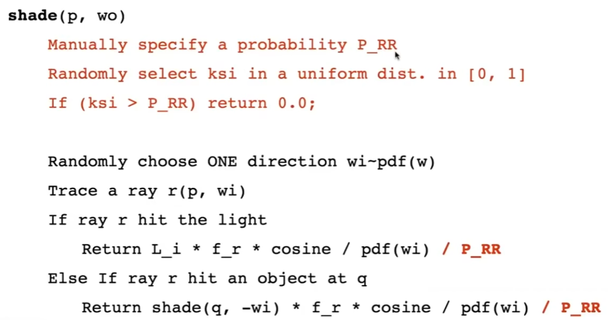

- 因素5：效率问题

5）渲染方程改成对光源采样和积分；（只计算直接光照）

solid angle：立体角

- 6：路径追踪中，点光源难以计算

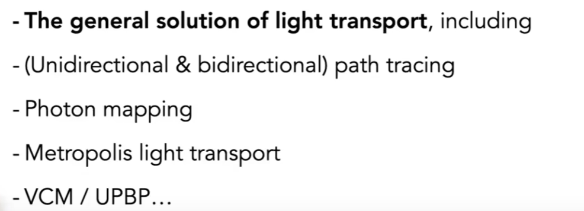

#### 2026.6.9 Games 101 Material

材质和外观

光线和外观的作用

Uniform Diffused Models/Lambertian Material

albedo (color)，反射率；

**Perfect Specular Reflection**

侧视图

镜像反射的俯视图 

- $\phi_o = (\phi_i + \pi)\ mod\ 2\pi$

##### Sepcular Refraction

costex：焦散

Snell's Law（斯涅尔定律）

- 角度跟介质折射率的关系

- 只有$\frac{\eta_i}{\eta_j} > 1$，即入射介质折射率大于被入射的折射率才能出现折射；

BTDF（折射）; BSDF（散射）；

#### Fresnel Reflection / Term

菲涅尔项：反射光线比例随着跟表面法线角度的比例变化的曲线；

#### Microfacet Material（微表面材质）

- 远处材质，近处镜子

Q: 这个到底有什么用？A：用小镜子模拟反射

微表面

bumpy 凹凸

specular 高光

#### Isotropic/Anisotropic Materials

各向同性/各向异性材质

BRDF 各向异性的公式（例如水平和竖直方向的变化规律不同；）

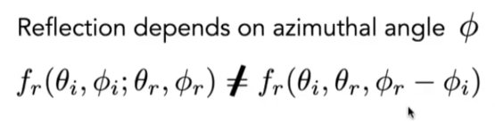

- Reciprocity principl

- - BRDF调换入射和出射的方向后，结果是一样的

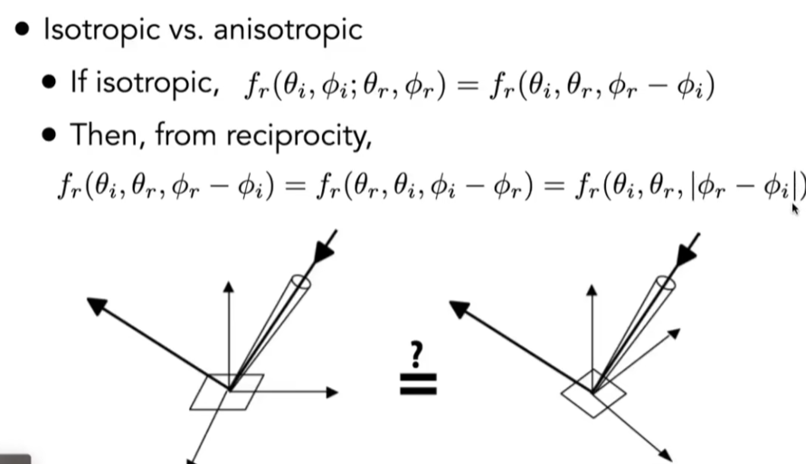

一个数据集：Tabular Representation
