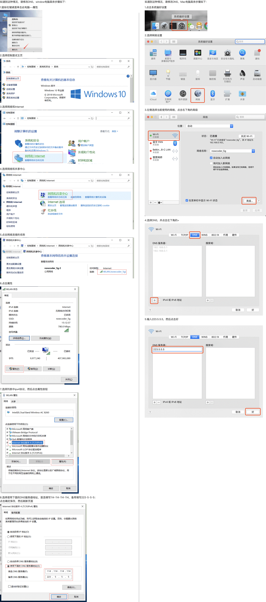

windows里怎么知道端口哪个进程在用

ssh密钥能连通虚拟机, 但是密码连通失败 (卡住了)
    选错认证方式了
    vagrant ssh-config

开VPN连接,后面关掉无法连接baidu.com(其他网站一般没问题);  
    浏览器提示: ERR_CONNECTION_RESET
    解决方式: ctrl + r  
        ipconfig /release  释放当前IP  
        ipconfig /flushdns  
        ipconfig /renew  
    参考:   https://www.zhihu.com/question/21512577

Reference
#### 浏览器网页加载不全

