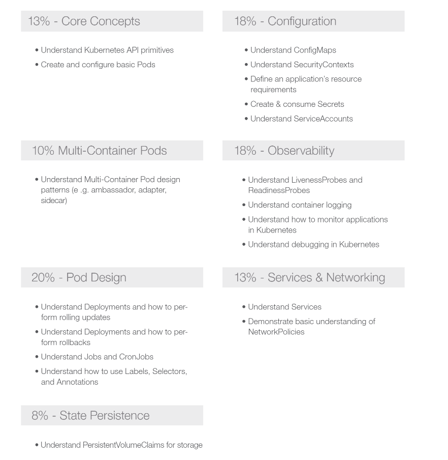

1. 报名链接
报名链接：https://www.cncf.io/certification/cka/
         https://www.cncf.io/certification/ckad/

时间:  
官网:  
价格:  $300 (-45 = 255, 255 * 7 = 1785)  
考纲:  https://github.com/cncf/curriculum  

准备的东西:
    护照 (用来证明身份和发证书);  
    银行信用卡 (过期时间和安全码),用于支付   

到官网后,注册LF账号,Enroll,
    优惠码: ANYWHERE30 打七折 (不定时)  
    DCUBEOFFER 优惠 45$

2. 中文网站

CKAD的考纲

- 13% Kubernetes API 核心概念  
- 18% ConfigMaps  安全上下文;创建&消费Secret  
- 10% Multi-Container Pods  
- 18% Observability 存活性,日志,监控,调试  
- 13% Pod Design 滚动更新, Job, CronJob; Label, Selector, Annotation
- 13% Service/Networking 网络策略

3. 真题
Github上关于CKAD练习题可以参考CKAD Exercises[10]以及ckad-prep-notes[11]。[4]

#### References
[Kubernetes CKA详细考试报名流程](https://blog.csdn.net/zhouwenjun0820/article/details/105881653)  
[CKAD认证备考经验分享](https://xiaozhou.net/tips-to-pass-the-ckad-exam-2020-09-26.html)  
[官网考纲](https://github.com/cncf/curriculum)

[2020年五一CKA/CKAD双证考试心得](https://zhuanlan.zhihu.com/p/138291642)  
[Essay: Design patterns for container-based distributed systems](https://link.zhihu.com/?target=https%3A//www.usenix.org/system/files/conference/hotcloud16/hotcloud16_burns.pdf)
