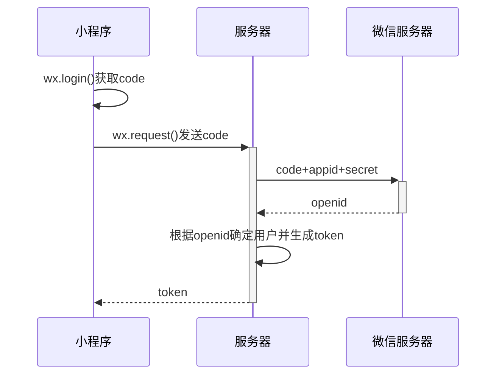

@startuml
类01 "1" *-- "many" 类02 : 包含

类03 o-- 类04 : 聚合

类05 --> "1" 类06
@enduml

@startuml
participant Participant as Foo #99FF99

actor       Actor1       as Foo1
boundary    Boundary    as Foo2
control     Control     as Foo3
entity      Entity      as Foo4
database    Database    as Foo5
collections Collections as Foo6
queue       Queue       as Foo7
Foo -> Foo1 : To actor 
Foo -> Foo2 : To boundary
Foo -> Foo3 : To control
Foo -> Foo4 : To entity
Foo -> Foo5 : To database
Foo -> Foo6 : To collections
Foo -> Foo7: To queue
@enduml

```类型 名称 别名```

@startuml
participant Participant [
    =Title
    ----
    ""SubTitle""
]

participant Bob

Participant -> Bob
@enduml


@startuml
Alice -> "Bob()" : hello
Long --> "Bob()" : ok
"Bob()" -> "This" as Long: retry
"Bob()" -> "Bob()": check
newpage
"Bob()" -> "This" as Long: retry
"Bob()" -> "Bob()": check
alt 成功情况
    Bob -> Alice: 认证接收
else 某种失败情况
    Bob -> Alice: 认证失败
else 另一种失败
    Bob -> Alice: 认证失败
end
@enduml



